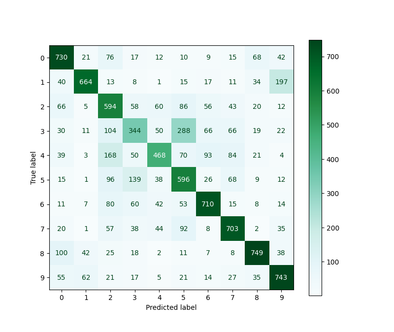

# LeNet Model with PyTorch 

The architecture of LeNet-5 (LeNet-5) is a convolutional neural network that was used to classify handwritten numbers on checks in America. This architecture was presented by Yann LeCun, Leon Botto, Yosuha Bengio and Patrick Haffner in 1998.

In the continuation of the PyTorch learning course exercises, I will implement this neural network model with the instructions of this course.

In this project, we train the model with CIFAR10 dataset.

### Note:
Since the LeNet model is used for Gray Scale photos and the data set is CIFAR10 RGB, as a result, the accuracy of our model will be low after training.

## ● ConfusionMatrix Output

